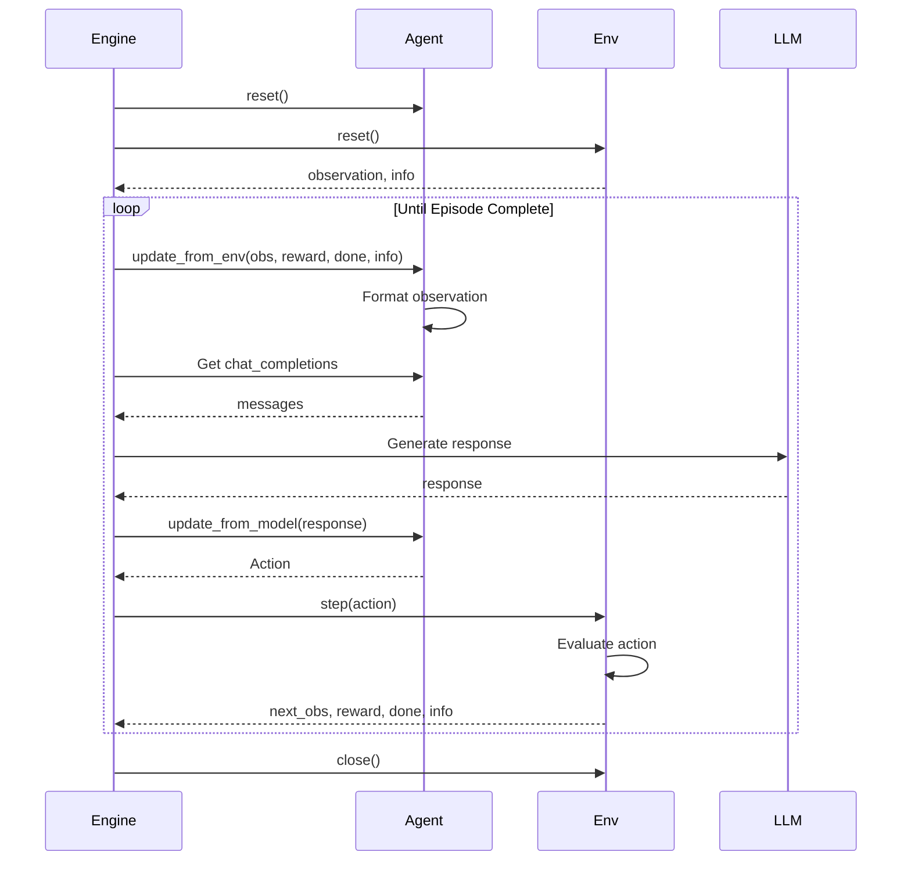

Agents and environments are the fundamental building blocks in rLLM. This guide explains their interfaces, responsibilities, and how to implement your own custom agents and environments.

## Overview

rLLM uses a modular approach where **agents** act as intelligent decision-makers and **environments** provide tasks and feedback. This separation enables:

- **Modular development**: Components can be built and tested independently
- **Flexible reuse**: The same agent can work across different environments
- **Consistent patterns**: Standardized interfaces ensure compatibility

## Agents

Agents are the core components that generate intelligent actions based on environmental observations. They serve as the bridge between language models and interactive environments.

### BaseAgent Interface

All agents inherit from `BaseAgent`, which defines essential methods for environment interaction:

```python
from rllm.agents.agent import BaseAgent, Step, Trajectory, Action

class BaseAgent(ABC):
    @abstractmethod
    def update_from_env(self, observation: Any, reward: float, done: bool, info: dict, **kwargs):
        """Updates agent state after receiving environment feedback."""
        pass
        
    @abstractmethod
    def update_from_model(self, response: str, **kwargs) -> Action:
        """Updates agent state after receiving model response."""
        pass
        
    @abstractmethod
    def reset(self):
        """Resets agent's internal state for new episode."""
        pass
        
    @property
    def chat_completions(self) -> list[dict[str, str]]:
        """Returns messages formatted for chat completion."""
        return []
    
    @property
    def trajectory(self) -> Trajectory:
        """Returns complete interaction history."""
        return Trajectory()

    def get_current_state(self) -> Step | None:
        """Returns the most recent step."""
        if not self.trajectory.steps:
            return None
        return self.trajectory.steps[-1]
```

**Source code**: [rllm/agents/agent.py:254](~/workspace/source/rllm/agents/agent.py)

### Key Agent Responsibilities

Each agent manages:

1. **State tracking**: Maintaining conversation history and internal state through trajectories
2. **Model interaction**: Formatting messages for language model consumption via `chat_completions`
3. **Response processing**: Handling and storing model outputs in `update_from_model()`
4. **Environment adaptation**: Updating state based on environmental feedback in `update_from_env()`

### Agent Implementation Example

Here's a complete implementation of a math agent with self-correction:

```python
import copy
from rllm.agents.agent import BaseAgent, Step, Trajectory, Action

class MathAgent(BaseAgent):
    """
    A math agent that solves problems step-by-step with self-correction capability.
    """
    def __init__(self, accumulate_thinking=True):
        self.instruction = "Let's think step by step and put your final answer within \\boxed{}."
        self._trajectory = Trajectory()
        self.messages = []
        self.accumulate_thinking = accumulate_thinking
        
    def update_from_env(self, observation: Any, reward: float, done: bool, info: dict, **kwargs):
        """Process environment feedback and update internal state."""
        
        # Format observation based on whether it's the initial problem or feedback
        if not self.trajectory.steps:
            # Initial problem presentation
            question = observation["question"]
            formatted_observation = f"{question} {self.instruction}"
        else:
            # Follow-up correction prompt
            formatted_observation = (
                "Your previous answer may contain a mistake. "
                "Please review it carefully and answer again."
            )

        # Update the last step's outcome if there are previous steps
        if self.trajectory.steps:
            prior_step = self.trajectory.steps[-1]
            prior_step.reward = reward
            prior_step.done = done
            prior_step.info = info
        
        if done:
            return
        
        # Add user message and create new step
        self.messages.append({"role": "user", "content": formatted_observation})
        new_step = Step(observation=formatted_observation)
        self.trajectory.steps.append(new_step)

    def update_from_model(self, response: str, **kwargs) -> Action:
        """Process model response and update trajectory."""
        assert self.trajectory.steps, "Trajectory should not be empty"
        
        # Update current step with model response
        cur_step = self.get_current_state()
        cur_step.model_response = response
        cur_step.chat_completions = copy.deepcopy(self.messages) + [
            {"role": "assistant", "content": response}
        ]
        
        # Add assistant message
        self.messages.append({"role": "assistant", "content": response})
        
        return Action(action=response)

    def reset(self):
        """Reset agent state for new episode."""
        self._trajectory = Trajectory()
        self.messages = []

    @property
    def chat_completions(self) -> list[dict[str, str]]:
        """Return conversation history for model interaction."""
        messages = copy.deepcopy(self.messages)
        
        # Optionally strip thinking tags from history
        if not self.accumulate_thinking:
            for msg in messages[:-1]:
                if msg["role"] == "assistant":
                    _, sep, after = msg["content"].partition("</think>")
                    if sep:
                        msg["content"] = after
        
        return messages
    
    @property
    def trajectory(self) -> Trajectory:
        """Return complete interaction trajectory."""
        return self._trajectory
```

<Info>
The `chat_completions` property is crucial - it's what the execution engine uses to construct prompts for the language model. It should return a list of messages in OpenAI chat format.
</Info>

## Environments

Environments provide tasks, evaluate agent actions, and manage episode lifecycles. They complement agents by defining the context within which agents operate and learn.

### BaseEnv Interface

All environments inherit from `BaseEnv`, which follows the Gymnasium interface:

```python
from rllm.environments.base.base_env import BaseEnv

class BaseEnv(ABC):
    @abstractmethod
    def reset(self) -> tuple[dict, dict]:
        """Reset environment and return initial observation and info."""
        pass

    @abstractmethod
    def step(self, action: Any) -> tuple[Any, float, bool, dict]:
        """Execute action and return (observation, reward, done, info)."""
        pass

    def close(self):
        """Clean up environment resources."""
        pass

    @staticmethod
    @abstractmethod
    def from_dict(env_args: dict) -> "BaseEnv":
        """Create environment instance from dictionary."""
        raise NotImplementedError()
    
    @staticmethod
    def is_multithread_safe() -> bool:
        """Whether environment can be safely used across threads."""
        return True
```

**Source code**: [rllm/environments/base/base_env.py:5](~/workspace/source/rllm/environments/base/base_env.py)

### Key Environment Responsibilities

Each environment handles:

1. **Task definition**: Providing problems or scenarios for agents to solve
2. **Observation generation**: Creating meaningful inputs for agent decision-making
3. **Action evaluation**: Assessing agent responses and providing rewards
4. **Episode management**: Determining when interactions should terminate

### Built-in Environment Types

rLLM provides base environment classes for common patterns:

#### SingleTurnEnvironment

For tasks requiring a single response:

```python
from rllm.environments.base import SingleTurnEnvironment
from rllm.rewards.reward_fn import RewardFunction

class SingleTurnEnvironment(MultiTurnEnvironment):
    def __init__(self, task: dict | None = None, reward_fn: RewardFunction | None = None):
        super().__init__(task=task, max_turns=1)
        self.reward_fn = reward_fn
    
    def get_reward_and_next_obs(self, task: dict, action: Any) -> tuple[float, dict]:
        """Compute reward based on task and action."""
        reward_output = self.reward_fn(task_info=task, action=action)
        return reward_output.reward, {}
```

**Source code**: [rllm/environments/base/single_turn_env.py:8](~/workspace/source/rllm/environments/base/single_turn_env.py)

#### MultiTurnEnvironment

For multi-step interactions:

```python
from rllm.environments.base import MultiTurnEnvironment

class MultiTurnEnvironment(BaseEnv, ABC):
    def __init__(self, task: dict | None = None, max_turns: int = 3):
        self.task = task
        self.max_turns = max_turns
        self.current_turn = 0
        self.done = False
        self.history = []
    
    def step(self, action):
        self.history.append(action)
        reward, next_obs = self.get_reward_and_next_obs(self.task, action)
        self.current_turn += 1
        
        if self.current_turn >= self.max_turns:
            self.done = True
            return {}, reward, self.done, self.task
        
        return next_obs, reward, self.done, self.task
    
    @abstractmethod
    def get_reward_and_next_obs(self, task: dict, action: Any) -> tuple[float, dict]:
        """Compute reward and next observation."""
        pass
```

**Source code**: [rllm/environments/base/multi_turn_env.py:7](~/workspace/source/rllm/environments/base/multi_turn_env.py)

### Environment Implementation Example

Here's a complete environment for math problems with self-correction:

```python
from rllm.environments.base import MultiTurnEnvironment
from rllm.rewards.reward_fn import math_reward_fn

class MathEnv(MultiTurnEnvironment):
    """
    Environment for mathematical problem solving with self-correction.
    """
    
    def __init__(self, task: dict | None = None, max_attempts: int = 2):
        super().__init__(task=task, max_turns=max_attempts)
        self.is_correct = False
    
    def get_reward_and_next_obs(self, task: dict, action: Any) -> tuple[float, dict]:
        """Evaluate answer and provide reward."""
        # Use rLLM's math reward function
        reward_output = math_reward_fn(task_info=task, action=action)
        reward = reward_output.reward
        self.is_correct = reward > 0.0
        
        # No additional observation needed (agent handles formatting)
        return reward, {}
    
    @staticmethod
    def from_dict(env_args: dict) -> "MathEnv":
        """Factory method for creating environment from config."""
        return MathEnv(
            task=env_args.get("task", env_args),
            max_attempts=env_args.get("max_attempts", 2)
        )
```

<Warning>
The `from_dict()` static method is required for both inference and training. The execution engine uses it to instantiate environments from task dictionaries.
</Warning>

## The Interaction Cycle

Understanding how agents and environments interact is crucial. Here's the complete flow:



### Step-by-Step Flow

<Steps>
  <Step title="Episode Initialization">
    - Engine calls `agent.reset()` to clear state
    - Engine calls `env.reset()` to get initial observation
  </Step>
  
  <Step title="State Update">
    - Engine passes observation to `agent.update_from_env()`
    - Agent formats observation and prepares for model
  </Step>
  
  <Step title="Model Interaction">
    - Engine retrieves `agent.chat_completions`
    - Engine sends messages to language model
    - Model generates response
  </Step>
  
  <Step title="Response Processing">
    - Engine calls `agent.update_from_model(response)`
    - Agent processes response and returns Action
  </Step>
  
  <Step title="Environment Feedback">
    - Engine calls `env.step(action)`
    - Environment evaluates response and computes reward
    - Returns next observation, reward, done flag, and info
  </Step>
  
  <Step title="Iteration">
    - Process repeats until `done=True` or max steps reached
    - Engine calls `env.close()` for cleanup
  </Step>
</Steps>

## Data Structures

rLLM uses several key data structures to represent agent interactions:

### Step

Represents a single interaction turn:

```python
@dataclass
class Step:
    # Token-level data (for training)
    prompt_ids: list[int] = field(default_factory=list)
    response_ids: list[int] = field(default_factory=list)
    logprobs: list[float] = field(default_factory=list)
    
    # Conversation data
    chat_completions: list[dict[str, str]] = field(default_factory=list)
    
    # Agent state
    observation: Any = None
    thought: str = ""
    action: Any = None
    model_response: str = ""
    model_output: ModelOutput | None = None
    info: dict = field(default_factory=dict)
    
    # Environment feedback (filled by engine)
    reward: float = 0.0
    done: bool = False
    mc_return: float = 0.0
    
    # Training data (filled by advantage computer)
    advantage: list[float] | float | None = None
```

**Source code**: [rllm/agents/agent.py:15](~/workspace/source/rllm/agents/agent.py)

### Trajectory

Represents a sequence of steps for a single agent:

```python
@dataclass
class Trajectory:
    uid: str = field(default_factory=lambda: str(uuid.uuid4()))
    name: str = "default_traj_name"  # Agent/role identifier
    task: Any = None
    steps: list[Step] = field(default_factory=list)
    reward: float | None = None  # Trajectory-level reward
    info: dict = field(default_factory=dict)
    
    def is_cumulative(self) -> bool:
        """Check if chat_completions accumulate across steps."""
        # Returns True if each step's chat_completions includes all previous messages
        ...
```

**Source code**: [rllm/agents/agent.py:121](~/workspace/source/rllm/agents/agent.py)

### Episode

Represents a complete rollout (potentially multi-agent):

```python
@dataclass
class Episode:
    id: str = ""  # Format: "task_id:rollout_idx"
    task: Any = None
    termination_reason: TerminationReason | None = None
    is_correct: bool = False
    trajectories: list[Trajectory] = field(default_factory=list)
    metrics: dict = field(default_factory=dict)
    info: dict = field(default_factory=dict)
    
    @cached_property
    def task_id(self) -> str:
        return self.id.split(":")[0]
    
    @cached_property
    def rollout_idx(self) -> str:
        return self.id.split(":")[1]
```

**Source code**: [rllm/agents/agent.py:175](~/workspace/source/rllm/agents/agent.py)

### Action

Wrapper for agent actions:

```python
@dataclass
class Action:
    action: Any = None
```

**Source code**: [rllm/agents/agent.py:113](~/workspace/source/rllm/agents/agent.py)

## Complete Example: Math Self-Correction

Let's trace through a complete interaction with the math agent and environment:

### Initial Problem

1. **Environment Reset**: Returns `{"question": "What is 2+2?"}`
2. **Agent Processing**: 
   - `update_from_env()` receives observation
   - Formats as: "What is 2+2? Let's think step by step and put your final answer within \\boxed{}."
   - Creates Step 0 with this observation
3. **Model Generation**: 
   - Engine gets `chat_completions`: `[{"role": "user", "content": "..."}]`
   - Model generates: "Let me calculate: 2+2=5 \\boxed{5}"
4. **Response Processing**:
   - `update_from_model()` stores response in Step 0
   - Returns `Action(action="Let me calculate: 2+2=5 \\boxed{5}")`
5. **Evaluation**: `env.step()` evaluates, returns `reward=0.0, done=False`

### Self-Correction

1. **Feedback**: `update_from_env()` called with `reward=0.0, done=False`
2. **Agent Processing**:
   - Updates Step 0 with reward
   - Creates Step 1 with correction prompt
3. **Model Generation**: 
   - `chat_completions` now has initial Q&A plus correction prompt
   - Model generates: "You're right, let me recalculate: 2+2=4 \\boxed{4}"
4. **Final Evaluation**: `env.step()` returns `reward=1.0, done=True`

## Real-World Examples

rLLM includes many example agents and environments:

<CardGroup cols={2}>
  <Card title="Tool Agent" icon="wrench">
    Agent with function calling capabilities
    
    **Source**: [rllm/agents/tool_agent.py](~/workspace/source/rllm/agents/tool_agent.py)
  </Card>
  
  <Card title="Math Agent" icon="calculator">
    Specialized for mathematical reasoning
    
    **Source**: [rllm/agents/math_agent.py](~/workspace/source/rllm/agents/math_agent.py)
  </Card>
  
  <Card title="Code Agent" icon="code">
    For competitive programming tasks
    
    **Source**: [rllm/agents/code_agent.py](~/workspace/source/rllm/agents/code_agent.py)
  </Card>
  
  <Card title="FrozenLake" icon="snowflake">
    Grid navigation environment
    
    **Source**: [rllm/environments/frozenlake/](~/workspace/source/rllm/environments/frozenlake/)
  </Card>
</CardGroup>

## Best Practices

<Tip>
**State Management**: Always maintain clean state in `reset()`. The same agent/environment instance may be reused across multiple episodes.
</Tip>

<Tip>
**Chat Completions**: The `chat_completions` property should return a fresh list of messages for each call. It's what the execution engine uses to construct prompts.
</Tip>

<Tip>
**from_dict**: Implement `from_dict()` carefully - it's used both during inference and training to instantiate environments from task dictionaries.
</Tip>

<Tip>
**Thread Safety**: If your environment uses external resources (files, network), ensure `is_multithread_safe()` returns `False` or implement proper locking.
</Tip>

## Next Steps

<CardGroup cols={2}>
  <Card title="Execution Engine" icon="gears" href="/core-concepts/execution-engine">
    Learn how to orchestrate agent-environment interactions at scale
  </Card>
  <Card title="Workflow Engine" icon="diagram-project" href="/core-concepts/workflow-engine">
    Build complex multi-agent workflows
  </Card>
  <Card title="Training" icon="brain" href="/core-concepts/training">
    Train your agents with RL
  </Card>
  <Card title="Examples" icon="book" href="/examples/math-agent">
    Explore complete examples
  </Card>
</CardGroup>
