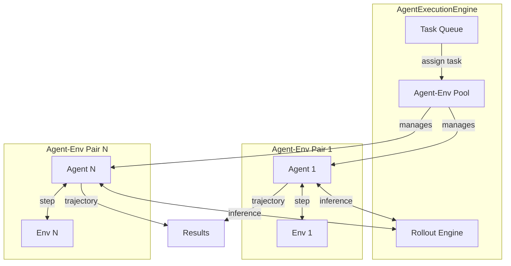
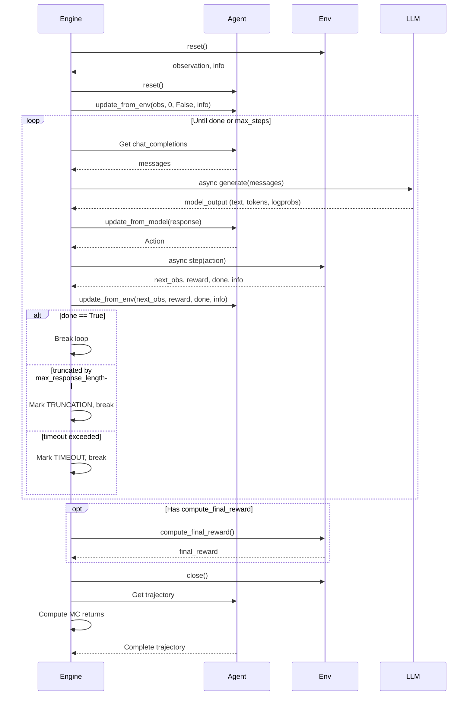

The `AgentExecutionEngine` is rLLM's low-level, high-performance orchestrator for agent-environment interactions. It manages parallel trajectory generation with full asynchronous execution, making it ideal for batch inference and RL training.

## Overview

The execution engine handles:

- **Parallel execution**: Manages multiple agent-environment pairs concurrently
- **Asynchronous orchestration**: Fully async LLM inference and environment steps
- **Token-level tracking**: Captures prompt/response tokens and log probabilities for training
- **Retry logic**: Automatic retry on failures with configurable limits
- **Multiple backends**: Supports OpenAI API, vLLM (via verl), and Tinker

**Source code**: [rllm/engine/agent_execution_engine.py:26](~/workspace/source/rllm/engine/agent_execution_engine.py)

## Architecture

The engine operates with a pool of agent-environment pairs:



### Key Components

1. **Agent-Environment Pairs**: Each pair operates independently and asynchronously
2. **Rollout Engine**: Handles LLM inference (OpenAI, verl, or Tinker backend)
3. **Thread Pool Executor**: Manages blocking environment operations
4. **Task Queue**: Distributes tasks across available agent-environment pairs

## Initialization

### Basic Setup

```python
from transformers import AutoTokenizer
from rllm.engine import AgentExecutionEngine
from rllm.agents import MyAgent
from rllm.environments import MyEnv

tokenizer = AutoTokenizer.from_pretrained("Qwen/Qwen3-4B")

engine = AgentExecutionEngine(
    # Agent and environment classes
    agent_class=MyAgent,
    env_class=MyEnv,
    agent_args={"system_prompt": "You are a helpful assistant"},
    env_args={"max_turns": 3},
    
    # Backend configuration
    engine_name="openai",  # or "verl" for training
    tokenizer=tokenizer,
    rollout_engine_args={
        "base_url": "http://localhost:30000/v1",
        "api_key": "your-api-key"
    },
    
    # Sampling parameters
    sampling_params={
        "temperature": 0.6,
        "top_p": 0.95,
        "model": "Qwen/Qwen3-4B"
    },
    
    # Execution parameters
    n_parallel_agents=128,      # Number of concurrent agent-env pairs
    max_steps=10,               # Max steps per trajectory
    max_response_length=4096,   # Max tokens in entire trajectory
    max_prompt_length=2048,     # Max tokens in prompt
    
    # Performance tuning
    trajectory_timeout=300,     # Timeout per trajectory (seconds)
    retry_limit=3,              # Retries on failure
    max_workers=64,             # Thread pool size for env operations
)
```

**Source code**: [rllm/engine/agent_execution_engine.py:27-127](~/workspace/source/rllm/engine/agent_execution_engine.py)

### Configuration Parameters

<Accordion title="Agent and Environment Configuration">
- **agent_class**: Your custom agent class (must inherit from `BaseAgent`)
- **env_class**: Your custom environment class (must inherit from `BaseEnv`)
- **agent_args**: Dictionary of arguments passed to agent constructor
- **env_args**: Dictionary of arguments passed to `env_class.from_dict()`
</Accordion>

<Accordion title="Backend Configuration">
- **engine_name**: Rollout backend - `"openai"` (API), `"verl"` (vLLM), or `"tinker"` (Megatron)
- **tokenizer**: HuggingFace tokenizer for the model
- **rollout_engine_args**: Backend-specific configuration (base_url, api_key, etc.)
- **sampling_params**: LLM sampling parameters (temperature, top_p, etc.)
</Accordion>

<Accordion title="Execution Configuration">
- **n_parallel_agents**: Number of concurrent agent-environment pairs (default: 128)
- **max_steps**: Maximum steps per trajectory (default: 5)
- **max_response_length**: Maximum total response tokens per trajectory (default: 8192)
- **max_prompt_length**: Maximum prompt tokens (default: 1024)
- **enforce_max_prompt_length**: Apply max_prompt check per-step vs per-trajectory (default: False)
</Accordion>

<Accordion title="Performance Configuration">
- **trajectory_timeout**: Timeout per trajectory in seconds (default: infinity)
- **retry_limit**: Number of retry attempts on failure (default: 3)
- **max_workers**: Thread pool size for environment operations (default: 64)
- **gamma**: Discount factor for MC returns (default: 0.2)
- **overlong_filter**: Mask out overlong trajectories (default: False)
</Accordion>

## Usage Patterns

### Batch Inference with execute_tasks

The primary method for batch trajectory generation:

```python
import asyncio
from rllm.data import DatasetRegistry

# Load tasks
tasks = DatasetRegistry.load_dataset("math", "test").get_data()

# Execute all tasks
trajectories = await engine.execute_tasks(tasks)

# Each trajectory contains complete interaction history
for traj in trajectories:
    print(f"Task: {traj.task}")
    print(f"Reward: {traj.reward}")
    print(f"Steps: {len(traj.steps)}")
    
    for i, step in enumerate(traj.steps):
        print(f"  Step {i}: {step.model_response}")
        print(f"  Reward: {step.reward}")
```

**How it works**:

<Steps>
  <Step title="Pool Initialization">
    Engine creates `n_parallel_agents` agent-environment pairs from `agent_class` and `env_class`
  </Step>
  
  <Step title="Task Distribution">
    Tasks are distributed to available agent-env pairs via an asynchronous queue
  </Step>
  
  <Step title="Parallel Execution">
    Each pair executes its task independently:
    - Environment resets with task data via `env_class.from_dict({**env_args, **task})`
    - Agent-environment interaction loop runs until done or max_steps
    - Results yield as trajectories complete
  </Step>
  
  <Step title="Dynamic Reallocation">
    When a pair completes, it immediately picks up the next task from the queue
  </Step>
</Steps>

**Source code**: [rllm/engine/agent_execution_engine.py:554-612](~/workspace/source/rllm/engine/agent_execution_engine.py)

### Training Mode with trajectory_generator

For RL training, use the generator pattern:

```python
# Initialize agents and environments
envs = [MyEnv.from_dict(task) for task in tasks]
agents = [MyAgent(**agent_args) for _ in tasks]
engine.update_envs_and_agents(envs, agents)

# Generate trajectories as async generator
async for trajectory in engine.trajectory_generator(mode="Text"):
    print(f"Generated trajectory with reward: {trajectory.reward}")
    # Process trajectory for training
```

**Return modes**:

- **"Text"**: Returns `Trajectory` objects (default)
- **"Token"**: Returns tokenized data for training
- **"Conversation"**: Returns chat completion messages
- **"Step"**: Returns individual steps with metadata

**Source code**: [rllm/engine/agent_execution_engine.py:505-552](~/workspace/source/rllm/engine/agent_execution_engine.py)

## Trajectory Generation Flow

Here's what happens during a single trajectory generation:



**Source code**: [rllm/engine/agent_execution_engine.py:180-429](~/workspace/source/rllm/engine/agent_execution_engine.py)

## Advanced Features

### Termination Handling

The engine handles multiple termination conditions:

```python
# Trajectories can terminate due to:
# - ENV_DONE: Environment signals completion
# - MAX_STEPS: Reached max_steps limit
# - TRUNCATION: Exceeded max_response_length
# - TIMEOUT: Trajectory timeout exceeded
# - ENV_TIMEOUT: Environment step timeout

# Access termination info in trajectory
for traj in trajectories:
    if traj.info.get("termination_reason") == "TRUNCATION":
        print(f"Trajectory {traj.uid} was truncated")
```

### Retry Logic

Automatic retry on failures:

```python
engine = AgentExecutionEngine(
    # ... other args ...
    retry_limit=3,  # Retry failed trajectories up to 3 times
)

# Retries happen automatically for:
# - API errors
# - Timeout errors
# - Environment errors (if recoverable)
```

**Source code**: [rllm/engine/agent_execution_engine.py:494-503](~/workspace/source/rllm/engine/agent_execution_engine.py)

### Custom Rollout Engines

The execution engine supports multiple backends:

<Tabs>
  <Tab title="OpenAI API">
    ```python
    engine = AgentExecutionEngine(
        engine_name="openai",
        rollout_engine_args={
            "base_url": "http://localhost:30000/v1",
            "api_key": "your-key",
        },
        sampling_params={
            "model": "Qwen/Qwen3-4B",
            "temperature": 0.6
        }
    )
    ```
  </Tab>
  
  <Tab title="verl (vLLM)">
    ```python
    # Used during RL training
    engine = AgentExecutionEngine(
        engine_name="verl",
        rollout_engine=verl_rollout_manager,  # Provided by trainer
        tokenizer=tokenizer,
    )
    ```
  </Tab>
  
  <Tab title="Tinker (Megatron)">
    ```python
    engine = AgentExecutionEngine(
        engine_name="tinker",
        rollout_engine_args={
            # Tinker-specific config
        },
    )
    ```
  </Tab>
</Tabs>

**Source code**: [rllm/engine/agent_execution_engine.py:98-124](~/workspace/source/rllm/engine/agent_execution_engine.py)

### Token Assembly for Training

When generating trajectories for training, the engine assembles token sequences:

```python
# In "Token" mode, trajectories are assembled into training format:
# prompt_tokens: Initial prompt from first step
# response_tokens: Concatenated completions + environment messages
# response_masks: Binary mask indicating which tokens contribute to loss

async for token_result in engine.trajectory_generator(mode="Token"):
    prompt_tokens = token_result["prompt_tokens"]      # torch.Tensor
    response_tokens = token_result["response_tokens"]  # torch.Tensor
    response_masks = token_result["response_masks"]    # torch.Tensor (0/1)
    trajectory_reward = token_result["trajectory_reward"]
```

**Source code**: [rllm/engine/agent_execution_engine.py:431-492](~/workspace/source/rllm/engine/agent_execution_engine.py)

## Complete Example

Here's a complete example using the FrozenLake environment:

```python
import asyncio
from transformers import AutoTokenizer
from rllm.engine import AgentExecutionEngine
from rllm.agents.frozenlake_agent import FrozenLakeAgent
from rllm.environments.frozenlake import FrozenLakeEnv
from rllm.data import DatasetRegistry
from rllm.utils import compute_pass_at_k

# Setup
model_name = "Qwen/Qwen3-4B"
tokenizer = AutoTokenizer.from_pretrained(model_name)

# Initialize engine
engine = AgentExecutionEngine(
    agent_class=FrozenLakeAgent,
    env_class=FrozenLakeEnv,
    agent_args={"max_steps": 10, "use_accumulate_history": True},
    env_args={"max_steps": 8, "is_slippery": False},
    engine_name="openai",
    tokenizer=tokenizer,
    rollout_engine_args={
        "base_url": "http://localhost:30000/v1",
        "api_key": "None",
    },
    sampling_params={
        "temperature": 0.6,
        "top_p": 0.95,
        "model": model_name
    },
    max_response_length=16384,
    max_prompt_length=4096,
    n_parallel_agents=256,
)

# Load tasks
tasks = DatasetRegistry.load_dataset("frozenlake", "test").get_data()

# Execute
results = asyncio.run(engine.execute_tasks(tasks))

# Evaluate
compute_pass_at_k(results)
```

**Source**: [examples/frozenlake/run_frozenlake_agent.py](~/workspace/source/examples/frozenlake/run_frozenlake_agent.py)

## Performance Considerations

<Tip>
**Parallelism**: Set `n_parallel_agents` based on your LLM backend's throughput. For OpenAI API, 128-256 works well. For local vLLM, adjust based on GPU memory.
</Tip>

<Tip>
**Thread Pool**: The `max_workers` parameter controls environment parallelism. Increase for I/O-heavy environments (e.g., web browsing).
</Tip>

<Tip>
**Timeouts**: Set `trajectory_timeout` to prevent hanging on problematic tasks. Typical values: 60-300 seconds.
</Tip>

<Warning>
**Memory**: Each agent-environment pair holds state in memory. For large batches, consider processing in chunks.
</Warning>

## Comparison with WorkflowEngine

| Feature | AgentExecutionEngine | AgentWorkflowEngine |
|---------|---------------------|--------------------|
| **Use Case** | Simple agent-env interactions | Complex multi-agent workflows |
| **Abstraction** | Low-level, direct control | High-level, workflow-based |
| **Multi-agent** | Single agent per trajectory | Multiple agents per episode |
| **Flexibility** | Limited to agent-env loop | Arbitrary orchestration logic |
| **Performance** | Slightly faster | Small overhead |
| **Recommended For** | Training, batch inference | Complex reasoning, tool use |

<Info>
For most use cases, especially during RL training, `AgentExecutionEngine` provides the best performance. Use `AgentWorkflowEngine` when you need complex multi-agent orchestration.
</Info>

## Next Steps

<CardGroup cols={2}>
  <Card title="Workflow Engine" icon="diagram-project" href="/core-concepts/workflow-engine">
    Learn about complex multi-agent workflows
  </Card>
  <Card title="Training" icon="brain" href="/core-concepts/training">
    Use the execution engine for RL training
  </Card>
  <Card title="Examples" icon="book" href="/examples/math-agent">
    See complete examples
  </Card>
  <Card title="API Reference" icon="code" href="/api/execution-engine">
    Detailed API documentation
  </Card>
</CardGroup>
