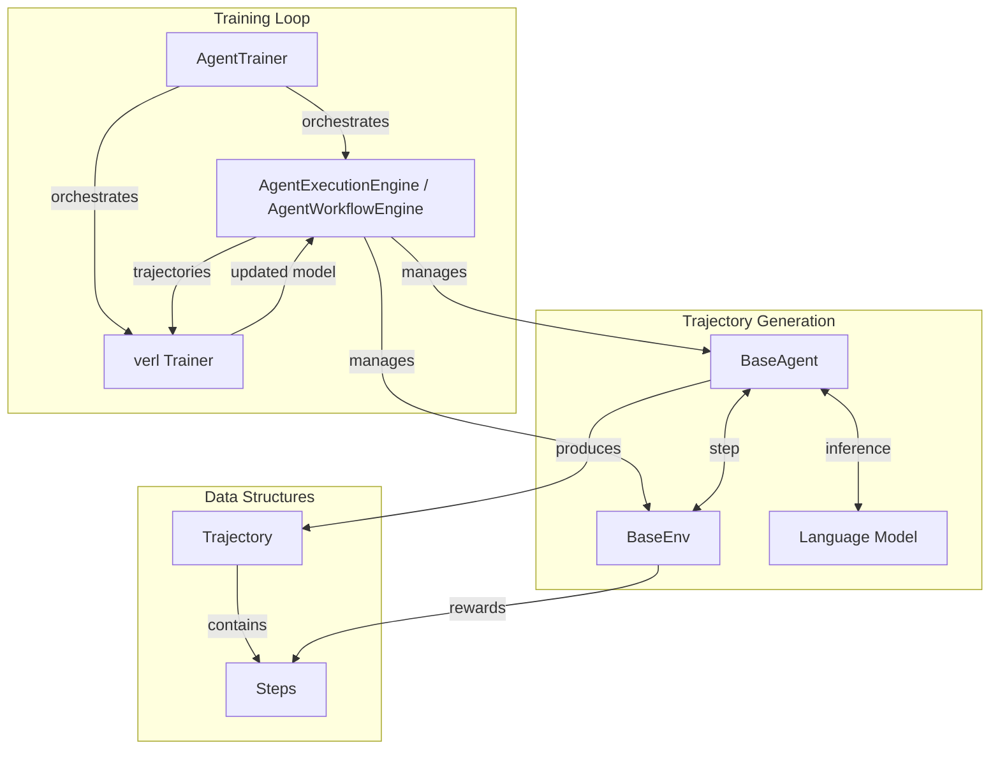

rLLM is an open-source framework for post-training language agents via reinforcement learning. It provides a modular architecture that makes it easy to build, train, and deploy agentic systems that learn from environmental feedback.

## The RL Training Loop

A typical RL system consists of two core components:

1. **Sampler**: Generates trajectories from the current policy (i.e., the agent interacting with environments)
2. **Trainer**: Computes gradients from the sampled trajectories and updates the policy

In **online RL**, this forms a closed training loop:

<Steps>
  <Step title="Trajectory Generation">
    The **sampler** generates a batch of trajectories using the current agent policy
  </Step>
  <Step title="Policy Update">
    The **trainer** updates the agent's weights using those trajectories
  </Step>
  <Step title="Iteration">
    A new batch is generated using the **updated agent**, and the cycle repeats
  </Step>
</Steps>

## rLLM's Modular Architecture

rLLM implements this training loop through several modular components:

### 1. Agent and Environment Abstractions

**`BaseAgent`** and **`BaseEnv`** provide simple, extensible interfaces for defining custom agents and environments:

- **BaseAgent**: Manages state, processes observations, interacts with language models, and tracks trajectories
- **BaseEnv**: Defines tasks, evaluates actions, provides rewards, and manages episode lifecycles

[Learn more about Agents and Environments →](/core-concepts/agents-environments)

### 2. Execution Engines

rLLM provides two engines for orchestrating agent-environment interactions:

#### AgentExecutionEngine

A low-level, high-performance engine for simple agent-environment interactions:

- Fully asynchronous and parallel trajectory generation
- Direct agent-environment step-by-step orchestration
- Optimized for single-agent tasks
- Supports both OpenAI API and vLLM backends

[Learn more about AgentExecutionEngine →](/core-concepts/execution-engine)

#### AgentWorkflowEngine

A high-level engine for complex, multi-agent workflows:

- Supports sophisticated multi-agent orchestration
- Workflow-based abstraction for complex reasoning chains
- Episode-level management and metrics
- Built-in retry logic and error handling

[Learn more about AgentWorkflowEngine →](/core-concepts/workflow-engine)

### 3. Training Infrastructure

**`AgentTrainer`** orchestrates the RL training loop:

- Integrates sampler (execution engines) with trainer ([verl](https://github.com/volcengine/verl))
- Supports PPO, GRPO, and other RL algorithms
- Distributed training via [Ray](https://www.ray.io/)
- Simple high-level API for training configuration

[Learn more about Training →](/core-concepts/training)

## Architecture Diagram

Here's how the components fit together:



## Key Data Structures

rLLM uses several core data structures to represent agent interactions:

### Step

Represents a single interaction turn:

```python
@dataclass
class Step:
    prompt_ids: list[int]          # Token IDs for the prompt
    response_ids: list[int]         # Token IDs for the response
    logprobs: list[float]           # Log probabilities
    chat_completions: list[dict]    # OpenAI-style messages
    observation: Any                # Environment observation
    thought: str                    # Agent's reasoning
    action: Any                     # Agent's action
    model_response: str             # Raw model output
    reward: float                   # Step reward
    done: bool                      # Episode termination flag
    advantage: float | list[float]  # Advantage for training
```

### Trajectory

Represents a sequence of steps for a single agent:

```python
@dataclass
class Trajectory:
    uid: str                  # Unique identifier
    name: str                 # Agent/role name
    task: Any                 # Task information
    steps: list[Step]         # Interaction history
    reward: float | None      # Trajectory-level reward
    info: dict                # Additional metadata
```

### Episode

Represents a complete rollout (potentially multi-agent):

```python
@dataclass
class Episode:
    id: str                         # Episode identifier (task_id:rollout_idx)
    task: Any                       # Task information
    termination_reason: TerminationReason  # Why episode ended
    is_correct: bool                # Success flag
    trajectories: list[Trajectory]  # All agent trajectories
    metrics: dict                   # Evaluation metrics
```

[See detailed API reference →](/core-concepts/agents-environments#data-structures)

## RL Algorithms

rLLM supports multiple RL algorithms optimized for language agent training:

- **PPO (Proximal Policy Optimization)**: Industry-standard policy gradient method
- **GRPO (Group Relative Policy Optimization)**: Efficient algorithm for language models
- **ReMax**: Reward maximization with KL regularization

[Learn more about RL Algorithms →](/core-concepts/rl-algorithms)

## Quick Start Example

Here's a minimal example showing how the components work together:

```python
from rllm.agents.agent import BaseAgent
from rllm.environments.base import SingleTurnEnvironment
from rllm.engine import AgentExecutionEngine
from rllm.trainer import AgentTrainer
from rllm.data import DatasetRegistry

# 1. Define your agent and environment
class MyAgent(BaseAgent):
    # Implement agent logic
    pass

class MyEnv(SingleTurnEnvironment):
    # Implement environment logic
    pass

# 2. Use execution engine for inference
engine = AgentExecutionEngine(
    agent_class=MyAgent,
    env_class=MyEnv,
    engine_name="openai",
    tokenizer=tokenizer,
    n_parallel_agents=64
)

tasks = DatasetRegistry.load_dataset("my_dataset", "test").get_data()
results = await engine.execute_tasks(tasks)

# 3. Use trainer for RL training
trainer = AgentTrainer(
    agent_class=MyAgent,
    env_class=MyEnv,
    config=config,
    train_dataset=train_dataset,
    val_dataset=val_dataset
)
trainer.train()
```

## Design Philosophy

rLLM's architecture follows these principles:

<Note>
**Modularity**: Each component has a clear responsibility and can be used independently or composed together.
</Note>

<Note>
**Flexibility**: The framework supports both simple single-agent tasks and complex multi-agent workflows.
</Note>

<Note>
**Performance**: Built-in asynchronous execution and distributed training for scalability.
</Note>

<Note>
**Compatibility**: Integrates with standard tools (OpenAI API, HuggingFace, Ray, verl).
</Note>

## Next Steps

Explore each component in detail:

<CardGroup cols={2}>
  <Card title="Agents & Environments" icon="robot" href="/core-concepts/agents-environments">
    Learn how to build custom agents and environments
  </Card>
  <Card title="Execution Engine" icon="gears" href="/core-concepts/execution-engine">
    Understand trajectory generation and orchestration
  </Card>
  <Card title="Workflow Engine" icon="diagram-project" href="/core-concepts/workflow-engine">
    Build complex multi-agent workflows
  </Card>
  <Card title="Training" icon="brain" href="/core-concepts/training">
    Train agents with reinforcement learning
  </Card>
</CardGroup>
