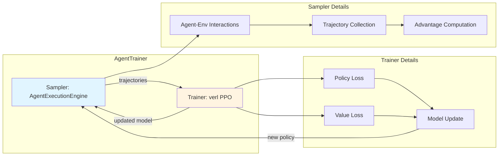

rLLM provides a high-level `AgentTrainer` class that orchestrates the complete RL training loop. It integrates trajectory generation (via execution engines) with policy optimization (via [verl](https://github.com/volcengine/verl)) and distributed execution (via [Ray](https://www.ray.io/)).

## Overview

The `AgentTrainer` simplifies RL training by providing:

- **Simple API**: Specify agent, environment, and datasets - then call `train()`
- **Multiple backends**: Supports verl (default), Fireworks, and Tinker
- **Distributed training**: Automatic Ray cluster management
- **Flexible configuration**: Hydra-based config system
- **Algorithm support**: PPO, GRPO, ReMax, and more

**Source code**: [rllm/trainer/agent_trainer.py:7](~/workspace/source/rllm/trainer/agent_trainer.py)

## The Training Loop

rLLM implements the standard online RL loop:



<Steps>
  <Step title="Trajectory Generation">
    The execution engine generates a batch of trajectories using the current agent policy
  </Step>
  
  <Step title="Advantage Computation">
    Advantages are computed from rewards (GRPO, PPO, etc.)
  </Step>
  
  <Step title="Policy Update">
    verl trainer updates the model weights using the trajectories
  </Step>
  
  <Step title="Iteration">
    New batch is generated with the updated model, cycle repeats
  </Step>
</Steps>

## Basic Usage

### Minimal Training Script

```python
import hydra
from omegaconf import DictConfig
from rllm.trainer import AgentTrainer
from rllm.data import DatasetRegistry
from rllm.agents import ToolAgent
from rllm.environments import ToolEnvironment
from rllm.rewards import math_reward_fn

@hydra.main(config_path="pkg://rllm.trainer.config", config_name="ppo_trainer", version_base=None)
def main(config: DictConfig):
    # Load datasets
    train_dataset = DatasetRegistry.load_dataset("math", "train")
    val_dataset = DatasetRegistry.load_dataset("math", "test")
    
    # Configure agent and environment
    agent_args = {
        "tools": ["python"],
        "parser_name": "qwen",
        "system_prompt": "Solve the math problem step by step."
    }
    
    env_args = {
        "tools": ["python"],
        "reward_fn": math_reward_fn,
        "max_turns": 5
    }
    
    # Create trainer
    trainer = AgentTrainer(
        agent_class=ToolAgent,
        env_class=ToolEnvironment,
        agent_args=agent_args,
        env_args=env_args,
        config=config,
        train_dataset=train_dataset,
        val_dataset=val_dataset,
        backend="verl"  # default
    )
    
    # Train!
    trainer.train()

if __name__ == "__main__":
    main()
```

### Workflow-Based Training

For complex multi-agent scenarios:

```python
from rllm.trainer import AgentTrainer
from rllm.workflows import SolverJudgeWorkflow

@hydra.main(config_path="pkg://rllm.trainer.config", config_name="ppo_trainer", version_base=None)
def main(config: DictConfig):
    train_dataset = DatasetRegistry.load_dataset("math", "train")
    val_dataset = DatasetRegistry.load_dataset("math", "test")
    
    workflow_args = {
        "n_solutions": 4,
        "reward_function": math_reward_fn,
        "solver_agent_cls": MathAgent,
        "judge_agent_cls": JudgeAgent,
    }
    
    trainer = AgentTrainer(
        workflow_class=SolverJudgeWorkflow,
        workflow_args=workflow_args,
        config=config,
        train_dataset=train_dataset,
        val_dataset=val_dataset,
    )
    
    trainer.train()
```

**Source code**: [rllm/trainer/agent_trainer.py:17-89](~/workspace/source/rllm/trainer/agent_trainer.py)

## Configuration System

rLLM uses [Hydra](https://hydra.cc/) for configuration management. Configs are located in `rllm/trainer/config/`.

### Loading Configs

```python
@hydra.main(config_path="pkg://rllm.trainer.config", config_name="ppo_trainer", version_base=None)
def main(config: DictConfig):
    # config is automatically loaded and merged
    pass
```

### Overriding Configs

You can override configs in three ways:

<Tabs>
  <Tab title="Command Line">
    ```bash
    python train.py \
        data.train_batch_size=64 \
        trainer.total_epochs=10 \
        actor_rollout_ref.model.path="Qwen/Qwen3-4B"
    ```
  </Tab>
  
  <Tab title="Config File">
    Create `config.yaml`:
    ```yaml
    data:
      train_batch_size: 64
      max_prompt_length: 2048
      max_response_length: 1024
    
    trainer:
      total_epochs: 10
      save_freq: 100
    ```
    
    Then:
    ```bash
    python train.py --config-path=/path/to/config
    ```
  </Tab>
  
  <Tab title="Programmatic">
    ```python
    from omegaconf import OmegaConf
    
    # Load base config
    config = OmegaConf.load("config.yaml")
    
    # Override specific values
    config.data.train_batch_size = 64
    config.trainer.total_epochs = 10
    
    # Pass to trainer
    trainer = AgentTrainer(
        agent_class=MyAgent,
        env_class=MyEnv,
        config=config,
        ...
    )
    ```
  </Tab>
</Tabs>

### Key Configuration Sections

<Accordion title="data - Dataset configuration">
```yaml
data:
  train_batch_size: 256           # Batch size for training
  val_batch_size: 256             # Batch size for validation
  max_prompt_length: 2048         # Max prompt tokens
  max_response_length: 1024       # Max response tokens
  train_files: null               # Auto-set from train_dataset
  val_files: null                 # Auto-set from val_dataset
```
</Accordion>

<Accordion title="trainer - Training parameters">
```yaml
trainer:
  total_epochs: 15                # Total training epochs
  save_freq: 100                  # Save checkpoint every N steps
  test_freq: 100                  # Run validation every N steps
  project_name: "rllm_training"   # W&B project name
  experiment_name: "math_agent"   # Experiment name
  logger: "wandb"                 # Logger backend (wandb/tensorboard)
  val_before_train: true          # Validate before training starts
```
</Accordion>

<Accordion title="actor_rollout_ref - Model and rollout config">
```yaml
actor_rollout_ref:
  model:
    path: "Qwen/Qwen3-4B"         # Model path/name
    enable_gradient_checkpointing: true
  
  rollout:
    mode: "async"                  # Rollout mode (async/sync)
    n: 8                           # Rollouts per task
    temperature: 0.6               # Sampling temperature
    log_prob_micro_batch_size: 64  # Batch size for logprob computation
  
  hybrid_engine: true              # Use hybrid engine (vLLM + PyTorch)
```
</Accordion>

<Accordion title="algorithm - RL algorithm settings">
```yaml
algorithm:
  advantage:
    kl_ctrl:
      type: "grpo"                 # Advantage type (grpo/ppo/remax)
      coeff: 0.05                  # KL coefficient
  
  ppo_mini_batch_size: 256       # PPO mini-batch size
  ppo_epochs: 1                   # PPO epochs per update
  entropy_coeff: 0.0              # Entropy bonus coefficient
  clip_ratio: 0.2                 # PPO clip ratio
```
</Accordion>

<Accordion title="rllm - rLLM-specific settings">
```yaml
rllm:
  agent:
    max_steps: 10                  # Max steps per trajectory
    trajectory_timeout: 300        # Timeout per trajectory (seconds)
    engine_args:
      n_parallel_agents: 256       # Parallel agent-env pairs
  
  stepwise_advantage:
    enable: false                  # Use step-level advantages
  
  compact_filtering:
    enable: true                   # Filter invalid trajectories
    mask_timeout: true             # Mask timeout trajectories
    mask_error: true               # Mask error trajectories
  
  workflow:
    use_workflow: false            # Use AgentWorkflowEngine
```
</Accordion>

## Training Backends

rLLM supports multiple training backends:

### verl (Default)

Best for most use cases. Supports both agent-env and workflow-based training:

```python
trainer = AgentTrainer(
    agent_class=MyAgent,
    env_class=MyEnv,
    config=config,
    train_dataset=train_dataset,
    val_dataset=val_dataset,
    backend="verl"  # default
)
trainer.train()
```

**Features**:
- Full PPO/GRPO support
- Distributed training via Ray
- Hybrid engine (vLLM + PyTorch)
- Advanced advantage computation

**Source code**: [rllm/trainer/agent_trainer.py:123-155](~/workspace/source/rllm/trainer/agent_trainer.py)

### Fireworks

Optimized for Fireworks API with workflow-based training:

```python
trainer = AgentTrainer(
    workflow_class=MyWorkflow,
    workflow_args={...},
    config=config,
    train_dataset=train_dataset,
    val_dataset=val_dataset,
    backend="fireworks"
)
trainer.train()
```

**Note**: Fireworks backend only supports workflow-based training, not agent_class/env_class.

**Source code**: [rllm/trainer/agent_trainer.py:157-181](~/workspace/source/rllm/trainer/agent_trainer.py)

### Tinker

For Megatron-based training (deprecated):

```python
trainer = AgentTrainer(
    agent_class=MyAgent,
    env_class=MyEnv,
    config=config,
    train_dataset=train_dataset,
    val_dataset=val_dataset,
    backend="tinker"
)
trainer.train()
```

**Source code**: [rllm/trainer/agent_trainer.py:98-121](~/workspace/source/rllm/trainer/agent_trainer.py)

## Under the Hood: verl Training

Let's examine what happens during verl training:

### AgentPPOTrainer

The core trainer class that orchestrates the RL loop:

```python
class AgentPPOTrainer(RayPPOTrainer):
    """PPO trainer for agents with environments."""
    
    def __init__(
        self,
        config,
        tokenizer,
        role_worker_mapping,
        resource_pool_manager,
        env_class,
        agent_class,
        env_args,
        agent_args,
        **kwargs
    ):
        super().__init__(...)
        self.env_class = env_class
        self.agent_class = agent_class
        
        # Initialize AgentExecutionEngine
        self.agent_execution_engine = AsyncAgentExecutionEngine(
            rollout_engine=self.async_rollout_manager,
            config=self.config,
            engine_name="verl",
            tokenizer=self.tokenizer,
            max_steps=self.config.rllm.agent.max_steps,
            agent_class=self.agent_class,
            env_class=self.env_class,
            ...
        )
```

**Source code**: [rllm/trainer/verl/agent_ppo_trainer.py:33-88](~/workspace/source/rllm/trainer/verl/agent_ppo_trainer.py)

### Training Loop

The `fit_agent()` method runs the complete training loop:

```python
def fit_agent(self):
    """Main training loop."""
    
    # Load checkpoint if exists
    self._load_checkpoint()
    
    # Validation before training
    if self.val_reward_fn and self.config.trainer.val_before_train:
        val_metrics = self._validate_agent()
        logger.log(val_metrics, step=0)
    
    for epoch in range(self.config.trainer.total_epochs):
        for batch_idx, batch in enumerate(train_dataloader):
            # 1. Generate trajectories
            envs, agents = self.init_envs_and_agents(batch)
            self.agent_execution_engine.update_envs_and_agents(envs, agents)
            
            rollout_data = []
            async for traj in self.agent_execution_engine.trajectory_generator():
                rollout_data.append(traj)
            
            # 2. Compute advantages
            rollout_data = self.compute_advantages(rollout_data)
            
            # 3. Update policy
            metrics = self.update_policy(rollout_data)
            
            # 4. Log metrics
            logger.log(metrics, step=self.global_steps)
            self.global_steps += 1
            
            # 5. Save checkpoint
            if self.global_steps % self.config.trainer.save_freq == 0:
                self._save_checkpoint()
            
            # 6. Validation
            if self.global_steps % self.config.trainer.test_freq == 0:
                val_metrics = self._validate_agent()
                logger.log(val_metrics, step=self.global_steps)
```

**Source code**: [rllm/trainer/verl/agent_ppo_trainer.py:126-315](~/workspace/source/rllm/trainer/verl/agent_ppo_trainer.py)

### Advantage Computation

rLLM supports multiple advantage computation methods:

```python
def compute_advantages(self, rollout_data):
    """Compute advantages for trajectories."""
    
    if self.config.algorithm.advantage.kl_ctrl.type == "grpo":
        # Group Relative Policy Optimization
        # Compare trajectories within same task
        advantages = compute_grpo_advantages(
            rollout_data,
            baseline="mean",  # or "max"
        )
    
    elif self.config.algorithm.advantage.kl_ctrl.type == "ppo":
        # Proximal Policy Optimization  
        # Use value network for baseline
        advantages = compute_ppo_advantages(
            rollout_data,
            value_network=self.critic,
            gamma=self.config.algorithm.gamma,
            lambda_=self.config.algorithm.gae_lambda,
        )
    
    return advantages
```

See [RL Algorithms](/core-concepts/rl-algorithms) for detailed explanations.

## Datasets

rLLM uses the `DatasetRegistry` for managing training data:

```python
from rllm.data import DatasetRegistry

# Load pre-registered datasets
train_dataset = DatasetRegistry.load_dataset("math", "train")
val_dataset = DatasetRegistry.load_dataset("math", "test")

# Or create custom dataset
from rllm.data import Dataset

custom_data = [
    {"question": "What is 2+2?", "answer": "4"},
    {"question": "What is 3+3?", "answer": "6"},
]

train_dataset = Dataset.from_list(custom_data, name="custom_math")

# Pass to trainer
trainer = AgentTrainer(
    agent_class=MyAgent,
    env_class=MyEnv,
    train_dataset=train_dataset,
    val_dataset=val_dataset,
    config=config,
)
```

## Distributed Training

rLLM uses Ray for distributed training:

### Ray Configuration

```yaml
ray_init:
  address: null               # Ray cluster address (null for local)
  num_cpus: null              # Number of CPUs (null for auto-detect)
  num_gpus: null              # Number of GPUs (null for auto-detect)
  object_store_memory: null   # Object store memory (null for default)
```

### Multi-Node Training

```bash
# On head node:
ray start --head --port=6379

# On worker nodes:
ray start --address=<head-node-ip>:6379

# In training script:
@hydra.main(config_path="pkg://rllm.trainer.config", config_name="ppo_trainer", version_base=None)
def main(config):
    # Override Ray address
    config.ray_init.address = "ray://<head-node-ip>:10001"
    
    trainer = AgentTrainer(
        agent_class=MyAgent,
        env_class=MyEnv,
        config=config,
        ...
    )
    trainer.train()
```

## Monitoring and Logging

rLLM supports multiple logging backends:

### Weights & Biases

```yaml
trainer:
  logger: "wandb"
  project_name: "rllm_training"
  experiment_name: "math_agent_v1"
```

### TensorBoard

```yaml
trainer:
  logger: "tensorboard"
  project_name: "rllm_training"
```

### Logged Metrics

The trainer automatically logs:

- **Rewards**: Mean/std/min/max trajectory rewards
- **Success Rate**: Percentage of successful trajectories
- **Episode Length**: Mean/std trajectory length
- **Training Metrics**: Policy loss, value loss, entropy, KL divergence
- **Timing**: Rollout time, training time, total time

## Checkpointing

### Automatic Checkpointing

```yaml
trainer:
  save_freq: 100              # Save every 100 steps
  checkpoint_dir: "checkpoints/"
```

Checkpoints are saved to `{checkpoint_dir}/{experiment_name}/step_{global_steps}/`

### Manual Checkpointing

```python
# In custom training loop
trainer._save_checkpoint()

# Load checkpoint
trainer._load_checkpoint()
```

## Complete Training Example

Here's a complete example training a math agent:

```python
import hydra
from omegaconf import DictConfig
from rllm.trainer import AgentTrainer
from rllm.data import DatasetRegistry
from rllm.agents import ToolAgent
from rllm.environments import ToolEnvironment
from rllm.rewards import math_reward_fn

@hydra.main(config_path="pkg://rllm.trainer.config", config_name="ppo_trainer", version_base=None)
def main(config: DictConfig):
    # Load datasets
    train_dataset = DatasetRegistry.load_dataset("math", "train")
    val_dataset = DatasetRegistry.load_dataset("math", "test")
    
    # Agent configuration
    agent_args = {
        "tools": ["python"],
        "parser_name": "qwen",
        "system_prompt": "Solve math problems step by step. Use Python for calculations."
    }
    
    # Environment configuration
    env_args = {
        "tools": ["python"],
        "reward_fn": math_reward_fn,
        "max_turns": 5
    }
    
    # Create trainer
    trainer = AgentTrainer(
        agent_class=ToolAgent,
        env_class=ToolEnvironment,
        agent_args=agent_args,
        env_args=env_args,
        config=config,
        train_dataset=train_dataset,
        val_dataset=val_dataset,
    )
    
    # Train
    trainer.train()

if __name__ == "__main__":
    main()
```

**Run with**:
```bash
python train_math_agent.py \
    data.train_batch_size=256 \
    trainer.total_epochs=10 \
    actor_rollout_ref.model.path="Qwen/Qwen3-4B" \
    algorithm.advantage.kl_ctrl.type="grpo"
```

## Best Practices

<Tip>
**Start Small**: Begin with a small batch size and short epochs to validate your setup before scaling up.
</Tip>

<Tip>
**Monitor Early**: Use W&B or TensorBoard from the start to catch issues early.
</Tip>

<Tip>
**Validation**: Always run validation before training (`val_before_train: true`) to verify your setup.
</Tip>

<Tip>
**Checkpointing**: Set `save_freq` low initially (e.g., 10) to avoid losing progress.
</Tip>

<Warning>
**Memory**: Watch GPU memory usage. Reduce `train_batch_size` or `max_response_length` if OOM.
</Warning>

<Warning>
**Hyperparameters**: RL is sensitive to hyperparameters. Start with the defaults and tune carefully.
</Warning>

## Next Steps

<CardGroup cols={2}>
  <Card title="RL Algorithms" icon="brain" href="/core-concepts/rl-algorithms">
    Learn about PPO, GRPO, and other algorithms
  </Card>
  <Card title="Examples" icon="book" href="/examples/overview">
    See complete training examples
  </Card>
  <Card title="Configuration" icon="gear" href="/configuration/overview">
    Detailed configuration reference
  </Card>
  <Card title="Distributed Training" icon="server" href="/guides/distributed-training">
    Scale to multiple GPUs/nodes
  </Card>
</CardGroup>
