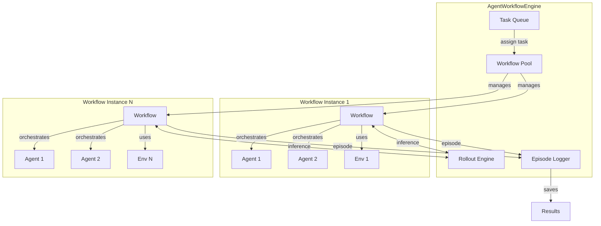
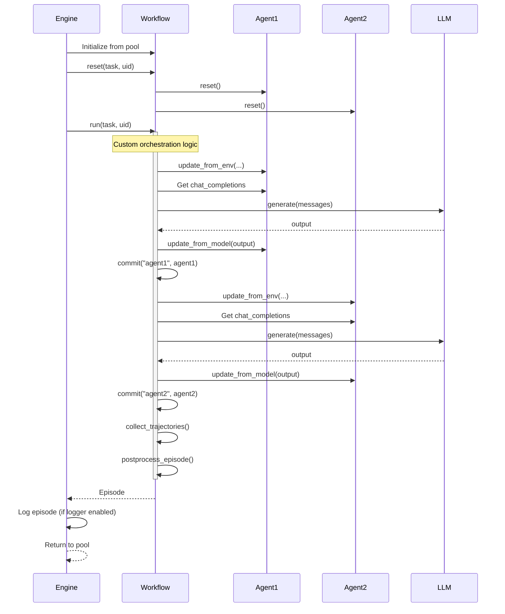

The `AgentWorkflowEngine` is rLLM's high-level orchestrator for complex multi-agent workflows. Unlike the `AgentExecutionEngine` which handles simple agent-environment loops, the workflow engine enables sophisticated orchestration patterns like multi-agent collaboration, hierarchical reasoning, and tool-augmented workflows.

## Overview

The workflow engine provides:

- **Multi-agent coordination**: Orchestrate multiple agents working together
- **Flexible workflows**: Define arbitrary interaction patterns beyond simple loops
- **Episode management**: Track complete episodes with multiple trajectories
- **Retry logic**: Built-in retry mechanisms with configurable strategies
- **Episode logging**: Optional logging of episodes to disk for analysis

**Source code**: [rllm/engine/agent_workflow_engine.py:24](~/workspace/source/rllm/engine/agent_workflow_engine.py)

## Architecture

The engine maintains a pool of workflow instances for parallel execution:



### Key Components

1. **Workflow Pool**: Maintains reusable workflow instances
2. **Rollout Engine**: Shared LLM inference backend
3. **Task Queue**: Distributes tasks to available workflows
4. **Episode Logger**: Optional episode recording for debugging/analysis

## The Workflow Base Class

All workflows inherit from the `Workflow` base class:

```python
from rllm.workflows.workflow import Workflow, TerminationReason
from rllm.agents.agent import Episode, Trajectory
from rllm.engine.rollout import RolloutEngine
from concurrent.futures import ThreadPoolExecutor

class Workflow(ABC):
    def __init__(
        self, 
        rollout_engine: RolloutEngine,
        executor: ThreadPoolExecutor,
        timeout: float = 1e6,
        gamma: float = 0.0,
        reward_bonus_coeff: float = 0.0,
        **kwargs
    ):
        self.rollout_engine = rollout_engine
        self.executor = executor
        self.timeout = timeout
        self.gamma = gamma  # Discount factor
        self.reward_bonus_coeff = reward_bonus_coeff  # Reward shaping
        self._completed_trajectories: list[Trajectory] = []
    
    @abstractmethod
    async def run(self, task: dict, uid: str, **kwargs) -> Episode | None:
        """Execute the workflow on a single task."""
        pass
```

**Source code**: [rllm/workflows/workflow.py:32](~/workspace/source/rllm/workflows/workflow.py)

### Key Workflow Methods

<Accordion title="run() - Main execution logic">
Implement your workflow's orchestration logic:

```python
async def run(self, task: dict, uid: str, **kwargs) -> Episode:
    # Your workflow logic:
    # 1. Initialize agents/environments
    # 2. Orchestrate multi-step reasoning
    # 3. Collect trajectories
    # 4. Return episode
    pass
```
</Accordion>

<Accordion title="commit() - Save trajectories">
Commit agent trajectories for training:

```python
# Commit a trajectory with a name
self.commit(name="solver", agent=solver_agent, reset=True)

# Or commit a trajectory directly
self.commit(name="judge", trajectory=judge_trajectory)
```

**Source code**: [rllm/workflows/workflow.py:93-112](~/workspace/source/rllm/workflows/workflow.py)
</Accordion>

<Accordion title="reset() - Prepare for new task">
Reset workflow state (automatically called before each task):

```python
def reset(self, task: dict | None = None, uid: str | None = None):
    self.uid = uid
    self.task = task
    self._completed_trajectories = []
    # Auto-resets all BaseAgent and BaseEnv attributes
```

**Source code**: [rllm/workflows/workflow.py:240-267](~/workspace/source/rllm/workflows/workflow.py)
</Accordion>

<Accordion title="run_in_executor() - Blocking operations">
Run blocking operations in thread pool:

```python
# Run environment step in executor
obs, reward, done, info = await self.run_in_executor(
    env.step, action
)
```

**Source code**: [rllm/workflows/workflow.py:281-290](~/workspace/source/rllm/workflows/workflow.py)
</Accordion>

## Built-in Workflow Types

rLLM provides several pre-built workflow classes:

### SimpleWorkflow

Basic single-agent workflow with reward function:

```python
from rllm.workflows import SimpleWorkflow
from rllm.rewards import math_reward_fn

workflow = SimpleWorkflow(
    agent_cls=MathAgent,
    agent_args={"thinking": True},
    reward_function=math_reward_fn,
    rollout_engine=engine,
    executor=executor,
)
```

### SingleTurnWorkflow / MultiTurnWorkflow

Backward-compatible workflows that replicate `AgentExecutionEngine` behavior:

```python
from rllm.workflows import SingleTurnWorkflow

workflow = SingleTurnWorkflow(
    agent_cls=ToolAgent,
    env_cls=ToolEnvironment,
    agent_args={"tools": ["python"]},
    env_args={"reward_fn": code_reward_fn},
    rollout_engine=engine,
    executor=executor,
)
```

### Custom Workflows

Define complex orchestration patterns:

```python
from rllm.workflows.workflow import Workflow, TerminationReason
from rllm.agents.agent import Episode, BaseAgent

class SolverJudgeWorkflow(Workflow):
    """Multi-agent workflow with solver and judge."""
    
    def __init__(
        self,
        rollout_engine,
        executor,
        n_solutions: int = 4,
        **kwargs
    ):
        super().__init__(rollout_engine, executor, **kwargs)
        self.n_solutions = n_solutions
        
        # Initialize agents (reused across tasks)
        self.solver = SolverAgent()
        self.judge = JudgeAgent()
    
    async def run(self, task: dict, uid: str, **kwargs) -> Episode:
        # Reset workflow state
        self.reset(task=task, uid=uid)
        
        # Generate multiple solutions
        solutions = []
        for i in range(self.n_solutions):
            # Get solver's response
            messages = self.solver.chat_completions
            output = await self.rollout_engine.generate(messages)
            
            # Update solver
            action = self.solver.update_from_model(output.text)
            solutions.append(action.action)
            
            # Commit solver trajectory
            self.commit(name=f"solver_{i}", agent=self.solver, reset=True)
        
        # Judge selects best solution
        judge_prompt = self._format_judge_prompt(task, solutions)
        self.judge.update_from_env(judge_prompt, 0.0, False, {})
        
        messages = self.judge.chat_completions
        output = await self.rollout_engine.generate(messages)
        self.judge.update_from_model(output.text)
        
        # Evaluate selected solution
        selected = self._extract_selection(output.text)
        reward = self._compute_reward(task, solutions[selected])
        
        # Update judge with reward
        self.judge.get_current_state().reward = reward
        
        # Commit judge trajectory
        self.commit(name="judge", agent=self.judge)
        
        # Collect and postprocess episode
        episode = self.collect_trajectories()
        return self.postprocess_episode(episode, TerminationReason.ENV_DONE)
```

## Initialization

```python
from transformers import AutoTokenizer
from rllm.engine import AgentWorkflowEngine, OpenAIEngine

model = "Qwen/Qwen3-4B"
tokenizer = AutoTokenizer.from_pretrained(model)

# Initialize rollout engine
rollout_engine = OpenAIEngine(
    model=model,
    tokenizer=tokenizer,
    base_url="http://localhost:30000/v1",
    api_key="your-api-key",
    max_prompt_length=2048,
    max_response_length=1024,
)

# Initialize workflow engine
engine = AgentWorkflowEngine(
    workflow_cls=SolverJudgeWorkflow,
    workflow_args={
        "n_solutions": 4,
        "reward_function": math_reward_fn,
    },
    rollout_engine=rollout_engine,
    n_parallel_tasks=128,     # Number of parallel workflow instances
    retry_limit=3,            # Retry failed tasks up to 3 times
    raise_on_error=True,      # Raise exceptions on permanent failures
)
```

**Source code**: [rllm/engine/agent_workflow_engine.py:26-57](~/workspace/source/rllm/engine/agent_workflow_engine.py)

### Configuration Parameters

<Accordion title="Workflow Configuration">
- **workflow_cls**: Your workflow class (must inherit from `Workflow`)
- **workflow_args**: Arguments passed to workflow constructor
- **rollout_engine**: RolloutEngine instance for LLM inference
- **config**: Optional config for training integration
</Accordion>

<Accordion title="Execution Configuration">
- **n_parallel_tasks**: Number of parallel workflow instances (default: 128)
- **retry_limit**: Max retry attempts for failed tasks (default: 3)
- **raise_on_error**: Whether to raise on permanent failures (default: True)
</Accordion>

<Accordion title="Episode Logging (Optional)">
- **episode_logger**: Logger instance for saving episodes to disk
- Episodes are logged with training step, mode (train/val), and epoch
</Accordion>

## Usage Patterns

### Batch Execution

Execute workflows on multiple tasks:

```python
import asyncio
from rllm.data import DatasetRegistry

# Load tasks
tasks = DatasetRegistry.load_dataset("math", "test").get_data()

# Execute workflows
episodes = await engine.execute_tasks(tasks)

# Each episode contains multiple trajectories
for episode in episodes:
    print(f"Episode {episode.id}: {episode.is_correct}")
    print(f"Termination: {episode.termination_reason}")
    print(f"Metrics: {episode.metrics}")
    
    for traj in episode.trajectories:
        print(f"  {traj.name}: {traj.reward} ({len(traj.steps)} steps)")
```

**Source code**: [rllm/engine/agent_workflow_engine.py:139-195](~/workspace/source/rllm/engine/agent_workflow_engine.py)

### Training Integration

For RL training with verl:

```python
from verl import DataProto

# Set training step for episode logging
engine.set_training_step(step=100, mode="train", epoch=2)

# Execute with verl batch
verl_batch = await engine.execute_tasks_verl(batch)

# Returns DataProto ready for training
assert isinstance(verl_batch, DataProto)
```

**Source code**: [rllm/engine/agent_workflow_engine.py:197-223](~/workspace/source/rllm/engine/agent_workflow_engine.py)

## Episode Lifecycle

Here's the complete lifecycle of an episode in the workflow engine:



**Source code**: [rllm/engine/agent_workflow_engine.py:86-137](~/workspace/source/rllm/engine/agent_workflow_engine.py)

## Episode Postprocessing

The workflow base class provides automatic episode postprocessing:

```python
def postprocess_episode(
    self, 
    episode: Episode, 
    termination_reason: TerminationReason = None,
    error: dict = None
) -> Episode:
    """Process episode after workflow completes."""
    
    # 1. Assign task id and task
    episode.id = self.uid
    episode.task = self.task
    
    # 2. For each trajectory:
    for trajectory in episode.trajectories:
        # Remove incomplete final steps
        if trajectory.steps and not trajectory.steps[-1].chat_completions:
            trajectory.steps.pop()
        
        # Compute trajectory reward (default: sum of step rewards)
        self.compute_trajectory_reward(trajectory)
        
        # Adjust step rewards (reward shaping, discounting)
        if len(trajectory.steps) > 1:
            self.adjust_step_rewards(trajectory)
    
    # 3. Assign episode-level correctness
    self.assign_episode_correctness(episode)
    
    # 4. Collect metrics
    self.collect_metrics(episode)
    
    # 5. Store error details
    if error:
        episode.info["error"] = error
    
    # 6. Assign termination reason
    episode.termination_reason = termination_reason
    
    return episode
```

**Source code**: [rllm/workflows/workflow.py:198-238](~/workspace/source/rllm/workflows/workflow.py)

### Customizing Postprocessing

Override these methods to customize episode processing:

<Accordion title="compute_trajectory_reward()">
```python
def compute_trajectory_reward(self, trajectory: Trajectory):
    """Compute trajectory-level reward."""
    # Default: sum of step rewards
    trajectory.reward = np.sum([s.reward for s in trajectory.steps])
    
    # Custom: average reward
    # trajectory.reward = np.mean([s.reward for s in trajectory.steps])
```

**Source code**: [rllm/workflows/workflow.py:139-147](~/workspace/source/rllm/workflows/workflow.py)
</Accordion>

<Accordion title="adjust_step_rewards()">
```python
def adjust_step_rewards(self, trajectory: Trajectory):
    """Adjust step-level rewards with shaping or discounting."""
    # Reward shaping
    if self.reward_bonus_coeff > 0.0:
        raw_rewards = [s.reward for s in trajectory.steps]
        for i in range(1, len(trajectory.steps)):
            trajectory.steps[i].reward += (
                self.reward_bonus_coeff * (raw_rewards[i] - raw_rewards[i-1])
            )
    
    # Discount factor
    if self.gamma > 0.0:
        G = 0.0
        for step in reversed(trajectory.steps):
            G = step.reward + self.gamma * G
            step.reward = G
```

**Source code**: [rllm/workflows/workflow.py:149-170](~/workspace/source/rllm/workflows/workflow.py)
</Accordion>

<Accordion title="assign_episode_correctness()">
```python
def assign_episode_correctness(self, episode: Episode):
    """Determine if episode is correct."""
    # Default: correct if total reward > 0
    total_reward = sum(t.reward for t in episode.trajectories)
    episode.is_correct = total_reward > 0
    
    # Custom: correct if any trajectory has positive reward
    # episode.is_correct = any(t.reward > 0 for t in episode.trajectories)
```

**Source code**: [rllm/workflows/workflow.py:172-183](~/workspace/source/rllm/workflows/workflow.py)
</Accordion>

<Accordion title="collect_metrics()">
```python
def collect_metrics(self, episode: Episode):
    """Collect episode-level metrics."""
    # Default: accuracy per agent
    metrics = defaultdict(list)
    for traj in episode.trajectories:
        metrics[traj.name].append(traj.reward)
    episode.metrics = {
        f"{k}_acc": float(np.mean(v)) for k, v in metrics.items()
    }
    
    # Custom: add more metrics
    # episode.metrics["total_steps"] = sum(len(t.steps) for t in episode.trajectories)
```

**Source code**: [rllm/workflows/workflow.py:185-196](~/workspace/source/rllm/workflows/workflow.py)
</Accordion>

## Termination Handling

The workflow engine handles various termination scenarios:

```python
from rllm.workflows.workflow import TerminationReason, TerminationEvent

# Raise to trigger termination from within workflow
raise TerminationEvent(TerminationReason.MAX_TURNS_EXCEEDED)

# Available termination reasons:
# - MAX_PROMPT_LENGTH_EXCEEDED
# - MAX_RESPONSE_LENGTH_EXCEEDED
# - ENV_DONE (normal completion)
# - MAX_TURNS_EXCEEDED
# - TIMEOUT
# - ERROR (exception occurred)
# - UNKNOWN
```

**Source code**: [rllm/workflows/workflow.py:16-29](~/workspace/source/rllm/workflows/workflow.py)

### Retry Logic

Automatic retry on errors:

```python
# Engine retries failed tasks based on termination reason
async def process_task_with_retry(self, task, task_id, rollout_idx):
    for attempt in range(1, self.retry_limit + 1):
        episode = await workflow.run_with_termination_handling(task, uid)
        
        if episode.termination_reason != TerminationReason.ERROR:
            return episode  # Success
        
        if attempt < self.retry_limit:
            print(f"Retrying task {uid} (attempt {attempt}/{self.retry_limit})")
            continue
    
    # Permanent failure after retry_limit
    if self.raise_on_error:
        raise Exception(f"Task {uid} failed after {self.retry_limit} attempts")
    return episode
```

**Source code**: [rllm/engine/agent_workflow_engine.py:86-137](~/workspace/source/rllm/engine/agent_workflow_engine.py)

## Complete Example: DeepResearch Workflow

Here's a real-world example from the DeepResearch agent:

```python
from rllm.workflows.workflow import Workflow, TerminationReason
from rllm.agents.agent import Episode, Trajectory
from deepresearch_agent import MultiTurnReactAgent

class DeepResearchWorkflow(Workflow):
    """
    Workflow for multi-turn research with tool usage.
    """
    
    def __init__(self, rollout_engine, executor, tools: dict = None, **kwargs):
        super().__init__(rollout_engine, executor, **kwargs)
        self.tools = tools or {}
        
        # Create research agent
        self.agent = MultiTurnReactAgent(
            rollout_engine=rollout_engine,
            tools=self.tools,
            use_native_function_calling=True,
        )
    
    async def run(self, task: dict, uid: str, **kwargs) -> Episode:
        self.reset(task=task, uid=uid)
        
        question = task.get("question")
        answer = task.get("answer", "")
        
        # Run research agent
        result = await self.agent.run(question=question, answer=answer)
        
        # Convert to episode format
        episode = Episode(
            id=uid,
            task=task,
            is_correct=result.get("is_correct", False),
            trajectories=[Trajectory(
                name="research",
                task=task,
                steps=result.get("steps", []),
                reward=1.0 if result.get("is_correct") else 0.0,
            )],
            metrics={"accuracy": 1.0 if result.get("is_correct") else 0.0}
        )
        
        return self.postprocess_episode(episode, TerminationReason.ENV_DONE)
```

**Source**: [examples/deepresearch/deepresearch_workflow.py](~/workspace/source/examples/deepresearch/deepresearch_workflow.py)

## Best Practices

<Tip>
**Agent Initialization**: Initialize agents in `__init__()` and reuse them across tasks. Reset is handled automatically via the `reset()` method.
</Tip>

<Tip>
**Trajectory Commitment**: Call `commit()` after each agent completes its part. This ensures trajectories are properly tracked for training.
</Tip>

<Tip>
**Error Handling**: Let exceptions propagate - the engine's retry logic will handle them. Use `TerminationEvent` for controlled termination.
</Tip>

<Tip>
**Blocking Operations**: Always use `await self.run_in_executor()` for blocking operations (file I/O, network calls, etc.).
</Tip>

<Warning>
**Thread Safety**: Ensure your workflow is thread-safe if it accesses shared resources. Each workflow instance may be reused across tasks.
</Warning>

## Comparison with ExecutionEngine

| Feature | AgentExecutionEngine | AgentWorkflowEngine |
|---------|---------------------|--------------------|
| **Abstraction** | Low-level agent-env loop | High-level workflow orchestration |
| **Multi-agent** | Single agent per trajectory | Multiple agents per episode |
| **Flexibility** | Fixed interaction pattern | Arbitrary orchestration logic |
| **Use Cases** | Simple tasks, training | Complex reasoning, multi-agent |
| **Setup Complexity** | Simpler (agent + env) | More involved (workflow class) |
| **Performance** | Slightly faster | Small overhead (~5%) |
| **Episode Structure** | 1 trajectory per episode | N trajectories per episode |

<Info>
Use `AgentWorkflowEngine` when you need:
- Multiple agents collaborating (solver + judge, search + refine, etc.)
- Complex orchestration logic (iterative refinement, hierarchical planning)
- Fine-grained control over episode structure

Use `AgentExecutionEngine` when you need:
- Simple agent-environment interactions
- Maximum performance for training
- Straightforward single-agent tasks
</Info>

## Next Steps

<CardGroup cols={2}>
  <Card title="Training" icon="brain" href="/core-concepts/training">
    Train workflows with RL
  </Card>
  <Card title="Examples" icon="book" href="/examples/solver-judge">
    See complete workflow examples
  </Card>
  <Card title="Execution Engine" icon="gears" href="/core-concepts/execution-engine">
    Compare with low-level engine
  </Card>
  <Card title="API Reference" icon="code" href="/api-reference/workflow">
    Detailed API documentation
  </Card>
</CardGroup>
